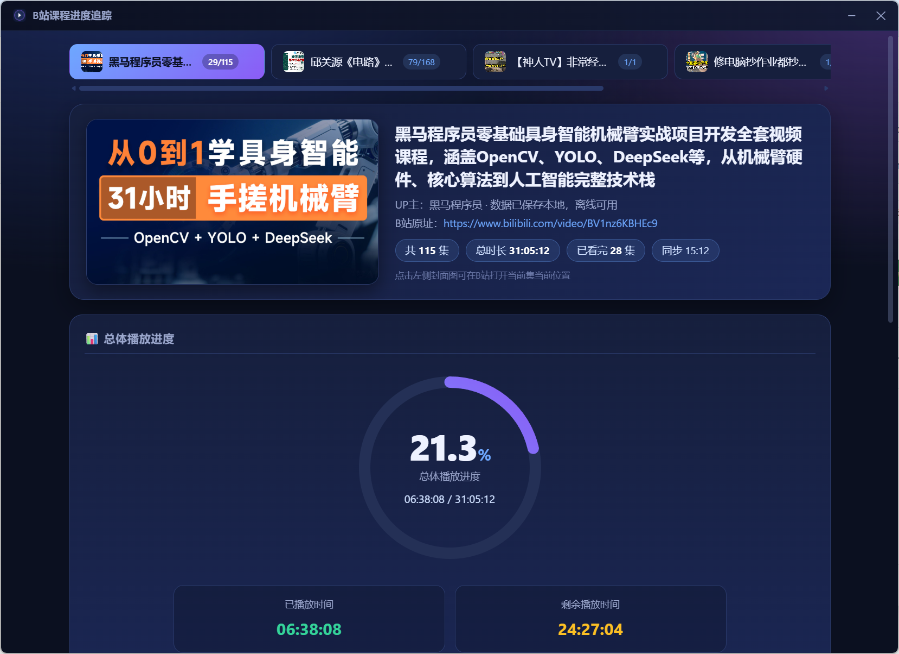

# B站课程进度追踪 · Bili Course Tracker

> 一款 Windows 桌面应用：把 B 站变成你的课程表，追踪每一门课程、每一集的观看进度。
> A lightweight Windows desktop app that tracks your Bilibili course-watching progress, episode by episode.

🪟 Windows 10/11 ｜ 🐍 Python 3.10+ ｜ 🖥️ pywebview · WebView2 ｜ 🔒 数据仅存本地



## 这是什么？

B 站上有大量优质课程（编程、考研、技能教学……），但它的历史记录是个"大杂烩"：
刷过的短视频、看过的番剧混在一起，想找到"上次那门课看到第几集"非常麻烦。

**B站课程进度追踪** 解决的就是这件事——

- 把你正在学的课程视频固定成一个 **课程列表**，封面、集数、进度一目了然
- 打开应用就自动从 B 站历史里 **同步真实观看进度**：看到第几集、看到几分几秒，精确恢复
- 每次同步检测 **跳跃与回看**：从第 29 集跳回第 1 集？集内从 10 分钟跳回 1 分钟？都会记录在"跳跃历史"，点击即可一键回到跳跃前的位置

## 功能特性

- **多课程管理**：顶部 Tab 切换课程，带封面缩略图和集数进度徽章
- **实时进度同步**：启动/切换/手动/每 5 分钟自动四种方式，从 B 站历史 cursor 接口读取真实进度
- **跳跃检测**：跨集大跳（向后 ≥3 集、向前 ≥5 集）与集内大幅回看（≥3 分钟）自动记录
- **离线可用**：断网时显示上次保存的本地进度，网络恢复自动重连重试
- **快捷操作**：`←` / `→` 键切集，进度条拖拽定位（带平滑动画）
- **SESSDATA 配置**：应用内设置面板粘贴即存，持久化到本地，重启/开机无需重新输入
- **自定义图标**：上传一张图自动生成圆角 ico 并更新桌面快捷方式
- **体验细节**：无边框窗口、八向自由拉伸、启动画面过渡、点 ✕ 秒关（数据实时落盘）

## 快速开始

### 方式一：直接使用（推荐）

1. 克隆或下载本仓库
2. 双击 **`B站课程进度追踪\B站课程进度追踪.exe`**（无需安装 Python）
3. 首次使用配置 SESSDATA（用于读取你的 B 站观看历史）：
   - 浏览器登录 bilibili.com → `F12` → 应用(Application) → Cookies → 复制 `SESSDATA` 的值
   - 粘贴到应用右上角 ⚙ 设置面板并保存

### 方式二：源码运行

```powershell
# 首次先安装依赖
安装依赖.bat          # pywebview / Pillow / PyInstaller

# 源码启动（数据目录与打包版共用）
py -3 src\app.py
```

### 方式三：自己打包

代码改动后双击 `打包.bat`（等价 `py -3 build.py`），自动生成 exe 并覆盖到 `B站课程进度追踪\`，数据不受影响。打包采用 `--onedir + --noconsole`：启动/关闭快、无黑窗口、前端单文件内嵌。

## 工作原理

```
pywebview 窗口 (WebView2)
   └── 单文件前端 index.html
         └── 本地 HTTP 服务 (127.0.0.1:8765，标准库 http.server)
               ├── B站历史 cursor 接口（HTTPS 长连接复用 + 分页命中即停）
               ├── 封面图代理（强制 IPv4 + 本地缓存，规避 IPv6 挂起）
               └── 本地存储 tracked_videos.json（原子写 + 线程锁）
```

- 应用只在本机运行，所有请求从你的电脑直接发往 B 站官方接口
- SESSDATA 仅保存于本地 `.sessdata.txt`，只用于调用 B 站 API，不回显、不上传、无任何第三方服务

## 目录结构

```
bili-course-tracker/
├── B站课程进度追踪/          ← 成品应用 + 数据（日常只用这个文件夹）
│   ├── B站课程进度追踪.exe    ← 主程序（无黑窗口）
│   ├── _internal/            ← 运行库（打包自动生成，勿动）
│   ├── .sessdata.txt         ← B站凭据（私密，勿分享）
│   ├── tracked_videos.json   ← 追踪列表与观看进度
│   └── covers/               ← 封面图本地缓存
├── src/                      ← 源代码（app.py / server.py / index.html）
├── assets/                   ← 默认图标
├── build.py + 打包.bat        ← 一键打包
├── 启动.bat                   ← 开发模式启动
└── 安装依赖.bat               ← 安装 Python 依赖
```

> 备份/迁移：整个 `B站课程进度追踪\` 文件夹拷走即可，全部数据都在里面。

## 常见问题

| 问题 | 说明 |
|---|---|
| 打开慢 / 杀毒报警 | PyInstaller 打包的程序可能被误报，添加信任即可 |
| 进度同步失败 | 多为 SESSDATA 过期（约 1 个月），设置面板重新粘贴即可；可访问 `http://127.0.0.1:8765/api/diag` 诊断连通性 |
| 开机后提示"离线模式" | 开机瞬间网络未就绪所致，联网后应用会自动重试恢复，无需手动操作 |
| 最近历史里找不到视频 | B 站历史接口可能过滤短时观看，在 B 站网页播放该视频 30 秒以上再刷新 |
| 窗口缩放 | 鼠标移到窗口四边/四角出现缩放光标后拖拽，最小 720×560 |

## 免责声明

本项目仅供个人学习进度管理使用，与 B 站官方无关。视频内容版权归原作者与哔哩哔哩所有；请合理使用，遵守 B 站用户协议，勿用于任何违规用途。
